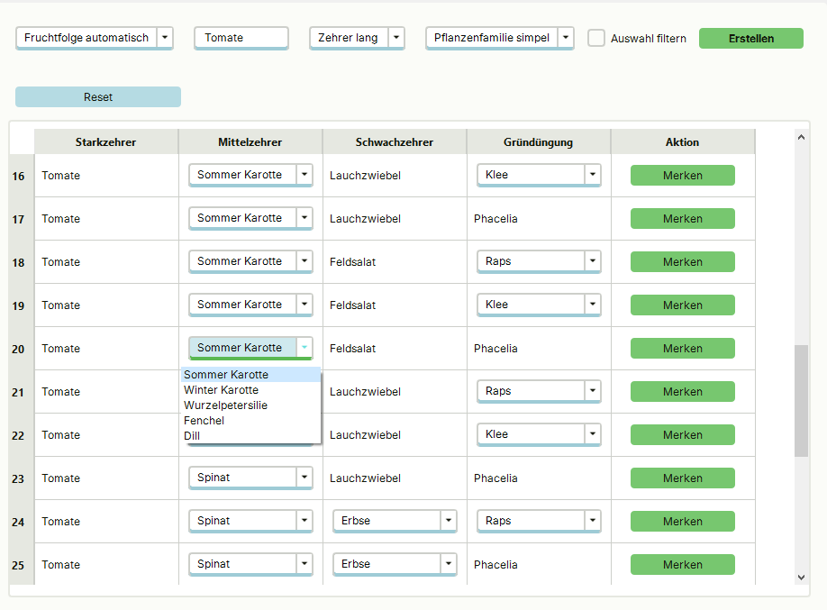
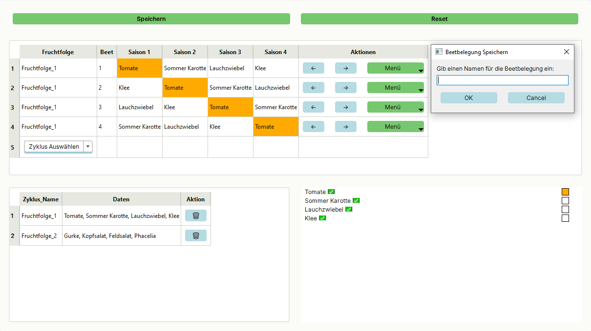
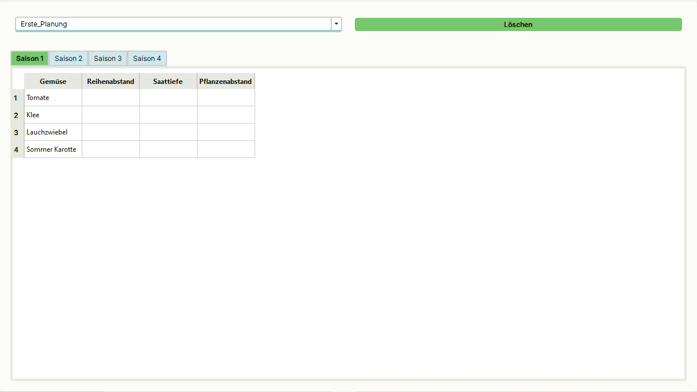

#  Vorschau: Fruchtfolge Manager

> **Hinweis:** Diese App ist noch in Entwicklung. Hier bekommst du einen ersten Einblick in Funktionen und Design.

---

##  Was ist der Fruchtfolge Manager?

Der Fruchtfolge Manager ist ein Planungstool für Gärtner*innen, das bei der **sachlich durchdachten Planung von Fruchtfolgen, Beeten und Mischkulturen** unterstützt.

---

##  Aktuelle Funktionen

###  Fruchtfolgetabelle
- Zentrale Planungsansicht
- Visualisierung von Fruchtfolgezyklen über Jahre
- Unterstützt die gezielte Auswahl passender Folgefrüchte
- Lässt sich auf Gründüngung anpassen

---

###  Fruchtfolge Verteilung
- Zeitliche Aufteilung einzelner Zyklen
- Historienansicht: Was war wann im Beet?

---

###  Beetansicht & Mengenplanung
- Darstellung der einzelnen Saisons
- Spezifische Daten zu den Pflanzen
- Später Automatische Berechnung von Pflanzmengen nach Abständen
- Später auch Saatgutbedarf
- Später Eingabe von Beetgröße (Länge, Breite)

---

##  Nächste Schritte

- Weitere UI-Optimierungen
- Testversion vorbereiten
- Planung von Mischkulturen

---

## 🙋 Interesse mitzumachen?

→ [Trage dich hier als Tester*in ein](../umfrage.md)

→ Oder schreibe mir direkt eine [persönliche Nachricht](mailto:fruchtfolge.manager@gmail.com)(fruchtfolge.manager@gmail.com)

---

##  Kommentare

